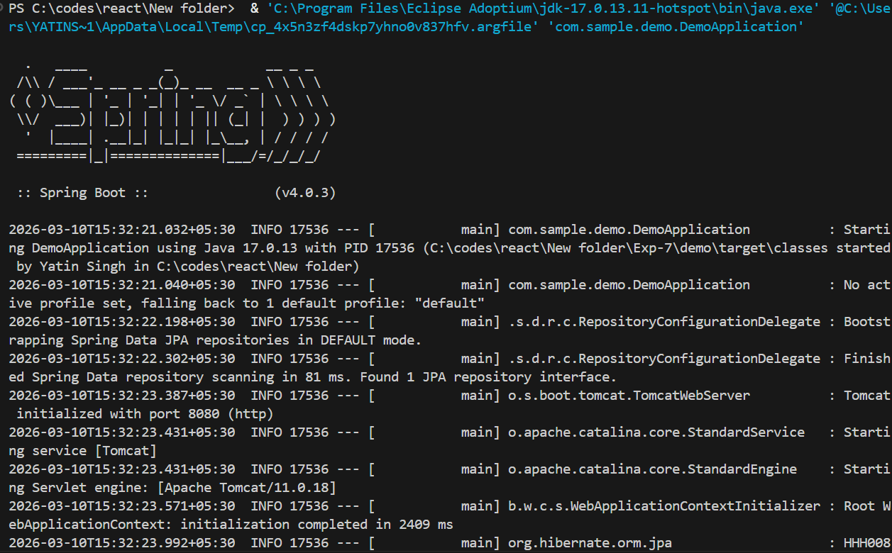
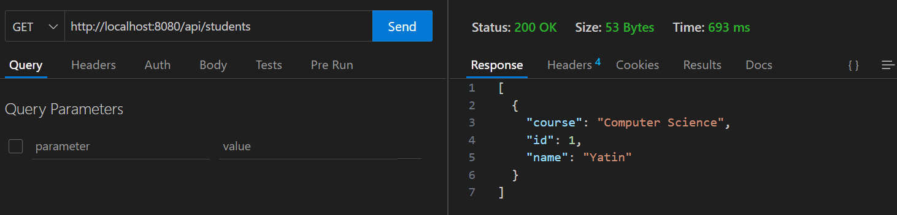
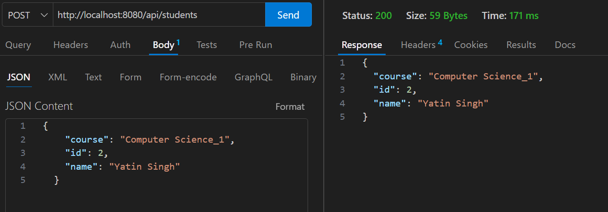

---

# 📚 Spring Boot Student Management API

## 📌 Overview

This project is a **Spring Boot REST API** that performs full **CRUD operations** on a `Student` entity using:

* Spring Boot
* Spring Data JPA
* MySQL

It demonstrates how to build a backend service that connects to a database and exposes RESTful endpoints.

---

# 🛠 Technologies Used

* Java 17
* Spring Boot
* Spring Data JPA
* MySQL
* Maven
* REST API
* Hibernate ORM

---

# 📁 Project Structure

```
com.sample.demo
│
├── controller
│      StudentController.java
│
├── service
│      StudentService.java
│
├── repository
│      StudentRepository.java
│
├── model
│      Student.java
│
└── DemoApplication.java
```

---

# ⚙️ Configuration

Database configuration is defined in:

```
src/main/resources/application.properties
```

### 🔹 MySQL Configuration

```
spring.datasource.url=jdbc:mysql://localhost:3306/spring_hibernate_db
spring.datasource.username=root
spring.datasource.password=12345678
spring.datasource.driver-class-name=com.mysql.cj.jdbc.Driver
```

### 🔹 Hibernate Configuration

```
spring.jpa.hibernate.ddl-auto=update
spring.jpa.show-sql=true
spring.jpa.database-platform=org.hibernate.dialect.MySQLDialect
```

### 🔹 Server Configuration

```
server.port=8080
```

---

# 🗄 Database Setup

Create a MySQL database before running the application:

```sql
CREATE DATABASE spring_hibernate_db;
```

Hibernate will automatically create the **student table**.

---

# 📦 Student Entity

The `Student` model represents a student record.

| Field  | Type   |
| ------ | ------ |
| id     | int    |
| name   | String |
| course | String |

---

# 🚀 API Endpoints

## 1️⃣ Get All Students

```
GET /api/students
```

Example:

```
http://localhost:8080/api/students
```

---

## 2️⃣ Get Student by ID

```
GET /api/students/{id}
```

Example:

```
http://localhost:8080/api/students/1
```

---

## 3️⃣ Add New Student

```
POST /api/students
```

### Request Body:

```json
{
  "id": 1,
  "name": "Yatin",
  "course": "Computer Science"
}
```

---

## 4️⃣ Update Student (PUT)

```
PUT /api/students/{id}
```

Example:

```
http://localhost:8080/api/students/1
```

### Request Body:

```json
{
  "name": "Yatin Singh",
  "course": "Information Technology"
}
```

### 📌 Description:

* Updates an existing student record
* Returns updated student data
* Throws error if student not found (based on implementation)

---

## 5️⃣ Delete Student

```
DELETE /api/students/{id}
```

Example:

```
http://localhost:8080/api/students/1
```

### 📌 Description:

* Deletes student by ID
* Returns success message or status

---

# ▶️ How to Run the Project

### Step 1 — Clone the Repository

```
git clone <repository-url>
```

### Step 2 — Open in IDE

Use **IntelliJ IDEA** or **VS Code**

### Step 3 — Install Dependencies

```
mvn clean install
```

### Step 4 — Run the Application

```
mvn spring-boot:run
```

OR run:

```
DemoApplication.java
```

### Step 5 — Test APIs

Use:

* Thunder Client
* Postman

---

# 📸 Screenshots

## Application Running in Terminal



---

## API Testing in Thunder Client



---

## API Testing in Thunder Client



---

# 📊 Architecture

```
Client
   │
   ▼
Controller (REST API)
   │
   ▼
Service Layer (Business Logic)
   │
   ▼
Repository Layer (JPA)
   │
   ▼
MySQL Database
```

---

# 📚 Concepts Demonstrated

* Spring Boot Application Setup
* REST API Development
* Controller Layer
* Service Layer
* Repository Layer
* Spring Data JPA
* Hibernate ORM
* MySQL Integration
* Full CRUD Operations

---

# 📌 Learning Outcome

After completing this project, you will understand:

* How to build a **Spring Boot REST API**
* How to connect **Spring Boot with MySQL**
* How **JPA repositories** work
* How **MVC architecture** works in backend systems
* How to implement **full CRUD operations using REST principles**

---

# 💡 Key Highlight (Interview Point)

👉 This API follows REST standards and implements full CRUD operations using proper HTTP methods:

* GET → Read
* POST → Create
* PUT → Update
* DELETE → Remove

---
