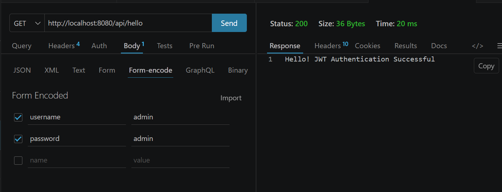
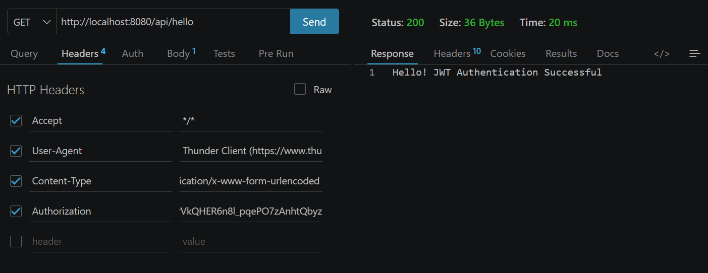

# JWT Authentication Demo - Spring Boot Application

A Spring Boot application demonstrating JWT (JSON Web Token) authentication with Spring Security, MySQL database integration, and REST APIs.

## 📋 Table of Contents

- [Project Overview](#project-overview)
- [Technology Stack](#technology-stack)
- [Prerequisites](#prerequisites)
- [Installation & Setup](#installation--setup)
- [API Endpoints](#api-endpoints)
- [API Request Examples](#api-request-examples)
- [Configuration](#configuration)
- [Running the Application](#running-the-application)
- [Screenshots](#screenshots)

## 🎯 Project Overview

This is a demo application showcasing:
- **JWT Authentication**: Secure authentication using JSON Web Tokens
- **Spring Security**: Authentication and authorization framework
- **REST APIs**: Login and Hello endpoints
- **MySQL Integration**: User data persistence
- **Form-Encoded Requests**: URL-encoded form data submission
- **HTTP Headers Management**: Custom headers for authentication

## 🛠 Technology Stack

| Technology | Version |
|-----------|---------|
| Spring Boot | 4.0.5 |
| Java | 17 |
| Spring Security | Latest |
| Spring Data JPA | Latest |
| MySQL | Latest |
| Maven | Build Tool |

## 📦 Prerequisites

- **Java Development Kit (JDK)**: Version 17 or higher
- **Maven**: Latest version
- **MySQL Server**: Running locally
- **Postman/Thunder Client**: For API testing (optional)

## ⚙️ Installation & Setup

### 1. Database Setup

Create a MySQL database for the JWT demo:

```sql
CREATE DATABASE jwt_demo;
USE jwt_demo;
```

Default credentials in `application.properties`:
- **Username**: root
- **Password**: 12345678
- **Database**: jwt_demo
- **Host**: localhost:3306

### 2. Clone/Extract Project

Navigate to the project directory:

```bash
cd Exp-9/demo
```

### 3. Install Dependencies

```bash
mvn clean install
```

## 📡 API Endpoints

### 1. Login Endpoint

**Endpoint**: `POST /api/login`

**Description**: Authenticates user with credentials and returns JWT token

**Base URL**: `http://localhost:8080`

**Request Format**: `application/x-www-form-urlencoded`

**Parameters**:
| Parameter | Type | Required | Description |
|-----------|------|----------|-------------|
| username | String | Yes | User login username |
| password | String | Yes | User login password |

**Response**: JWT token string for authenticated user

---

### 2. Hello Endpoint

**Endpoint**: `GET /api/hello`

**Description**: Returns a success message confirming JWT authentication

**Base URL**: `http://localhost:8080`

**Response**: `Hello! JWT Authentication Successful`

**Status Code**: `200 OK`

## 🔌 API Request Examples

### Example 1: Login Request (Form-Encoded Body)

This screenshot shows how to send a login request with form-encoded credentials:



**Details**:
- **Method**: POST
- **URL**: `http://localhost:8080/api/login`
- **Body Type**: Form-Encoded (application/x-www-form-urlencoded)
- **Parameters**:
  - `username`: admin
  - `password`: admin
- **Response**: JWT token returned on successful authentication

---

### Example 2: API Request with Headers

This screenshot shows the HTTP headers included in the request:



**Headers Details**:
| Header | Value | Purpose |
|--------|-------|---------|
| Accept | `*/*` | Accept any response format |
| User-Agent | Thunder Client | Client identification |
| Content-Type | `application/x-www-form-urlencoded` | Request body format |
| Authorization | JWT Token | Bearer token for authentication |

**Response**: Returns `Hello! JWT Authentication Successful` with status 200

---

## 🔐 Configuration

Edit `src/main/resources/application.properties`:

```properties
# Application Configuration
spring.application.name=demo
server.port=8080

# Database Configuration
spring.datasource.url=jdbc:mysql://localhost:3306/jwt_demo
spring.datasource.username=root
spring.datasource.password=12345678

# JPA/Hibernate Configuration
spring.jpa.hibernate.ddl-auto=update
spring.jpa.show-sql=true
spring.jpa.properties.hibernate.dialect=org.hibernate.dialect.MySQLDialect
```

### Configuration Parameters Explanation:

| Parameter | Value | Description |
|-----------|-------|-------------|
| `spring.datasource.url` | jdbc:mysql://localhost:3306/jwt_demo | MySQL database connection URL |
| `spring.datasource.username` | root | Database username |
| `spring.datasource.password` | 12345678 | Database password |
| `spring.jpa.hibernate.ddl-auto` | update | Auto-update database schema |
| `spring.jpa.show-sql` | true | Log SQL queries to console |
| `server.port` | 8080 | Application server port |

## 🚀 Running the Application

### Using Maven

```bash
mvn spring-boot:run
```

### Using IDE

1. Right-click on `DemoApplication.java`
2. Select **Run As** → **Java Application**
3. Or use the IDE's run button

### Application Startup

The application will:
1. Start on `http://localhost:8080`
2. Connect to MySQL database
3. Initialize/update the schema
4. Display logs showing successful startup

**Console Output Example**:
```
. . .
. . .
2024-01-15 10:30:45.123 INFO [main] DemoApplication : Started DemoApplication in 3.521 seconds (JVM running for 4.123)
```

## 📝 Project Structure

```
demo/
├── src/
│   ├── main/
│   │   ├── java/com/aml3_b/demo/
│   │   │   ├── controller/
│   │   │   │   └── AuthController.java      # REST endpoints
│   │   │   ├── service/
│   │   │   │   └── AuthService.java         # Business logic
│   │   │   ├── security/
│   │   │   │   └── JwtUtil.java             # JWT utilities
│   │   │   ├── config/
│   │   │   │   └── SecurityConfig.java      # Security configuration
│   │   │   ├── model/
│   │   │   │   └── User.java                # User entity
│   │   │   ├── repository/
│   │   │   │   └── UserRepository.java      # Database operations
│   │   │   └── DemoApplication.java         # Main application
│   │   └── resources/
│   │       └── application.properties       # Configuration file
│   └── test/
│       └── java/...                         # Unit tests
├── pom.xml                                  # Maven dependencies
├── Readme.md                                # This file
├── s1.png                                   # Form-encoded request screenshot
└── s2.png                                   # HTTP headers screenshot
```

## 🧪 Testing the API

### Using cURL

```bash
# Login request
curl -X POST http://localhost:8080/api/login \
  -H "Content-Type: application/x-www-form-urlencoded" \
  -d "username=admin&password=admin"

# Hello endpoint
curl -X GET http://localhost:8080/api/hello \
  -H "Authorization: Bearer <JWT_TOKEN>"
```

### Using Postman

1. **Create POST request** to `http://localhost:8080/api/login`
2. **Set Body** to `form-data` format
3. **Add parameters**: username=admin, password=admin
4. **Send request**
5. Copy the JWT token from response
6. **Create GET request** to `http://localhost:8080/api/hello`
7. **Add Authorization header** with Bearer token

## 📸 Screenshots

### Screenshot 1: Form-Encoded Body (s1.png)
Shows the login request with form-encoded credentials in the request body.

### Screenshot 2: HTTP Headers (s2.png)
Displays the HTTP headers including Authorization, Content-Type, and other metadata.

## 🔗 Related Files

- **pom.xml**: Maven project configuration and dependencies
- **application.properties**: Application configuration settings
- **DemoApplication.java**: Spring Boot application entry point
- **AuthController.java**: REST API endpoints definition
- **AuthService.java**: Authentication business logic
- **SecurityConfig.java**: Spring Security configuration
- **JwtUtil.java**: JWT token generation and validation

## 📝 Notes

- Ensure MySQL server is running before starting the application
- The database will be automatically created/updated on first run
- Default credentials are for demo purposes only
- Change password and configure properly for production use
- JWT tokens are generated upon successful login

## 🤝 Contributing

For issues or improvements, please review the code and configuration files.

## 📄 License

This is a demo project for learning purposes.

---

**Last Updated**: April 2024
**Application Port**: 8080
**Database**: MySQL (jwt_demo)
**Framework**: Spring Boot 4.0.5