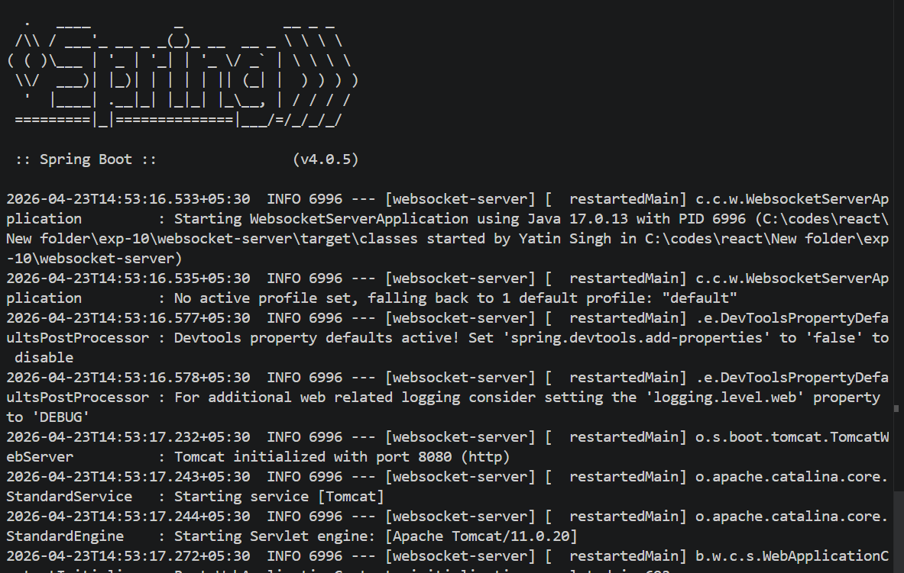
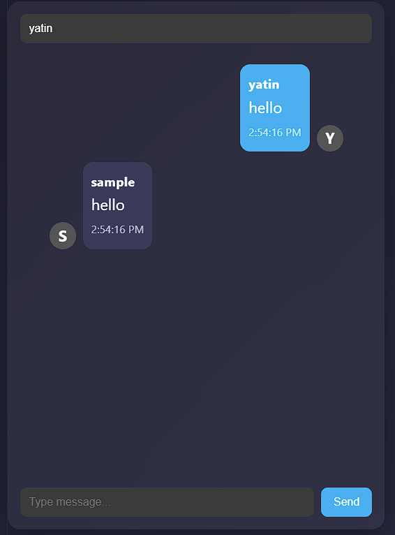

# 💬 WebSocket Chat Application (React + Spring Boot)

A real-time chat application built using **React (Vite)** on the frontend and **Spring Boot (WebSocket + STOMP)** on the backend.
This project demonstrates full-stack real-time communication using WebSockets.

---

## 🚀 Features

* 🔌 Real-time messaging using WebSockets
* ⚛️ React frontend with modern UI
* ☕ Spring Boot backend with STOMP protocol
* 💬 Chat bubbles (left/right alignment)
* ⏱️ Message timestamps
* 👤 Avatar initials
* ⌨️ Send message with Enter key
* 🔄 Auto-reconnect support

---

## 🛠️ Tech Stack

### Frontend

* React (Vite)
* JavaScript (JSX)
* SockJS
* STOMP.js

### Backend

* Spring Boot
* Spring WebSocket
* STOMP Protocol

---

## 📁 Project Structure

```
websocket-chat/
│
├── frontend/
│   ├── src/
│   │   ├── components/
│   │   │   ├── Chat.jsx
│   │   │   ├── MessageInput.jsx
│   │   │   └── MessageList.jsx
│   │   ├── App.jsx
│   │   ├── App.css
│   │   └── main.jsx
│
├── backend/
│   ├── config/
│   │   └── WebSocketConfig.java
│   ├── controller/
│   │   └── ChatController.java
│   ├── model/
│   │   └── ChatMessage.java
│
└── README.md
```

---

## ⚙️ Setup Instructions

### 1️⃣ Clone the Repository

```
git clone https://github.com/your-username/websocket-chat.git
cd websocket-chat
```

---

### 2️⃣ Run Backend (Spring Boot)

Navigate to backend folder:

```
cd backend
```

Run the application:

```
mvn spring-boot:run
```

✔ Server will start at:

```
http://localhost:8080
```

---

### 3️⃣ Run Frontend (React)

Open new terminal:

```
cd frontend
npm install
npm run dev
```

✔ App will run at:

```
http://localhost:5173
```

---

## 📸 Screenshots

### 🟢 Spring Boot Running



### 💬 Chat UI



---

## 🔌 WebSocket Flow

1. Client connects to:

```
/ws
```

2. Sends message to:

```
/app/send
```

3. Server broadcasts to:

```
/topic/messages
```

---

## 🧠 Learnings

* WebSocket lifecycle and real-time communication
* STOMP protocol for messaging
* React + backend integration
* Pub/Sub architecture
* Handling live UI updates

---

## 🔮 Future Improvements

* 🔐 Authentication (JWT)
* 💾 Store messages in database (MongoDB)
* 👥 Multiple chat rooms
* 🟢 Online user tracking
* 📱 Responsive mobile UI

---

## 🙌 Author

**Yatin Singh**
AI/ML Engineer & Full-Stack Developer

---
